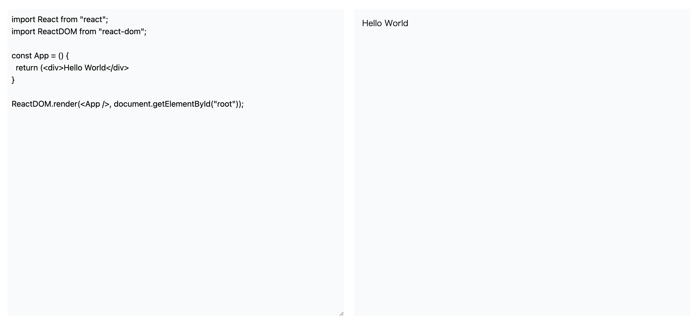

# BrowserBundler

Bundle React and TypeScript online without Node.js

## Playground

https://mosya.dev/tools/react-ts

## Screenshots



## Install

```
npm install browser-bundler
```

## Example

```js
import { browserBundle } from "browser-bundler";

const textarea = document.querySelector("#textarea") as HTMLTextAreaElement
const iframe = document.querySelector("#result") as HTMLIFrameElement

if (textarea && iframe) {
  textarea.value = `import React from "react";
import ReactDOM from "react-dom";

const App = () {
  return (<div>Hello World</div>
}

ReactDOM.render(<App />, document.getElementById("root"));`;

textarea.addEventListener("input", async () => {
  const code = textarea.value
  const { code: bundleCode } = await browserBundle(code)
  iframe.srcdoc = `
    <html>
      <head>
        <meta charset="utf-8">
      </head>
      <body>
        <div id="root"></div>
        <script type="module">
        ${bundleCode}
        </script>
      </body>
    </html>
  `
})
textarea.dispatchEvent(new Event("input"))
```


## Relative Path

```js
import { browserBundle } from "browser-bundler";

const code = `
import React from "react";
import ReactDOM from "react-dom";
import { Hello } from "./hello.tsx";

const App = () => {
  return (<div><Hello /></div>)
}

ReactDOM.render(<App />, document.getElementById("root"));
`

const result = await browserBundle(code, {
  files: {
    "./hello.tsx": `import React from "react";
    export const Hello = () => {
      return (<div>Hello World</div>)
    }`,
  }
})
```